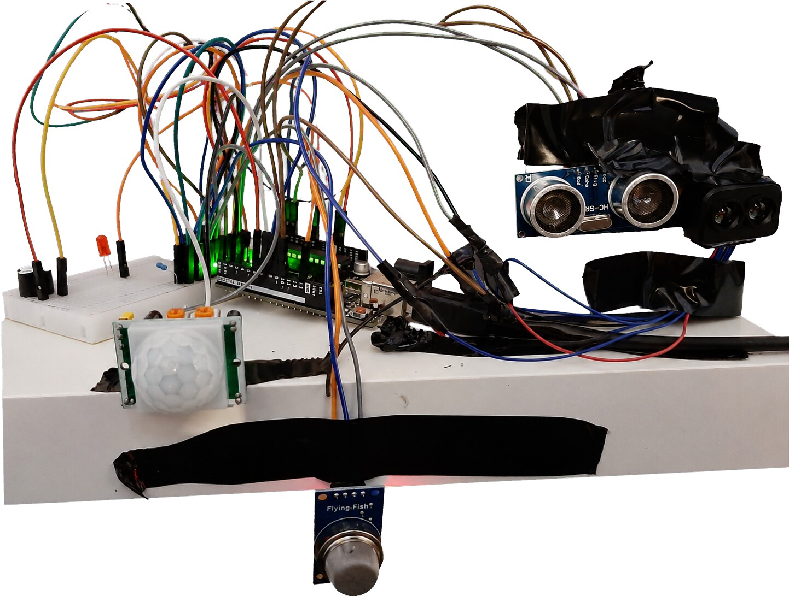
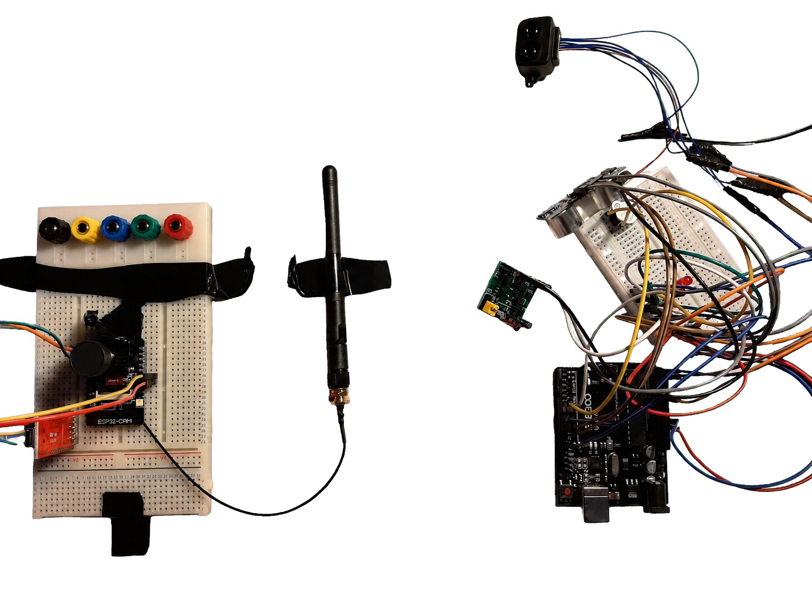

# ESP32-CAM Intruder Tracker

An educational embedded/IoT security prototype that combines motion, smoke/gas, ultrasonic, and LiDAR/ToF sensing with local alarms and an ESP32-CAM web interface.



## Project overview

The prototype has two firmware subsystems:

1. An Arduino-compatible sensor controller reads a PIR sensor, gas sensor, ultrasonic sonar, and LiDAR/ToF module. It smooths the sonar signal, combines both distance measurements with a lightweight Kalman-style estimator, and activates local LED/buzzer alerts.
2. An ESP32-CAM provides still-image capture, live MJPEG streaming, SD-card photo storage, and experimental MJPEG recording through HTTP endpoints.

The current sketches demonstrate the sensing/alarm and camera subsystems separately. An automatic GPIO or HTTP trigger between the sensor controller and ESP32-CAM is a logical next integration step.

## Features

- PIR motion detection
- MQ-style analog smoke/gas monitoring with normal and critical thresholds
- Ultrasonic and LiDAR/ToF distance sensing
- Moving-average sonar smoothing
- Sequential sensor fusion for a more stable distance estimate
- LED and dual-buzzer alerts
- ESP32-CAM still images at three resolutions
- Browser-accessible live stream
- Photo and experimental MJPEG recording to microSD
- Serial telemetry for calibration and testing

## Repository layout

```text
firmware/
  sensor_controller/   Sensor fusion, gas/motion detection, and alarms
  esp32_cam/            Camera web server and SD-card capture
docs/
  ARCHITECTURE.md       System design and data flow
  WIRING.md             Pin map and wiring notes
  TESTING.md            Test evidence and calibration checklist
  images/               Prototype and serial-monitor evidence
```

## Hardware

| Subsystem | Components used in the prototype |
| --- | --- |
| Sensor controller | Arduino-compatible board, HC-SR04-style ultrasonic sensor, TFLI2C-compatible LiDAR/ToF sensor, PIR sensor, analog gas/smoke sensor, LED, two buzzers |
| Camera | AI Thinker ESP32-CAM, camera module, microSD card, Wi-Fi network |
| General | Breadboards, jumper wires, suitable regulated supplies, common ground |

See [docs/WIRING.md](docs/WIRING.md) for the firmware pin map.

## Software dependencies

### Sensor controller

- Arduino IDE or Arduino CLI
- `Wire` (included with the Arduino core)
- `NewPing`
- `TFLI2C`

### ESP32-CAM

- Arduino IDE or Arduino CLI with the Espressif ESP32 board package
- An `esp32cam` library that supplies `<esp32cam.h>` and the `esp32cam` namespace used by the sketch
- `WiFi`, `WebServer`, and `SD_MMC` from the ESP32 Arduino core

## Quick start

### 1. Sensor controller

1. Open `firmware/sensor_controller/sensor_controller.ino`.
2. Install `NewPing` and `TFLI2C` through the Arduino Library Manager.
3. Confirm the pin assignments and thresholds against your hardware.
4. Select the correct Arduino-compatible board and upload the sketch.
5. Open the Serial Monitor at `115200` baud.

### 2. ESP32-CAM

1. Copy `firmware/esp32_cam/secrets.example.h` to `firmware/esp32_cam/secrets.h`.
2. Put your Wi-Fi SSID and password in `secrets.h`.
3. Select the AI Thinker ESP32-CAM board profile and upload `esp32_cam.ino`.
4. Open the Serial Monitor at `115200` baud and note the printed IP address.
5. Open one of the endpoints below from a device on the same trusted network.

| Endpoint | Purpose |
| --- | --- |
| `/cam-lo.jpg` | 640 × 480 still image |
| `/cam-mid.jpg` | 1280 × 720 still image |
| `/cam-hi.jpg` | 1920 × 1080 still image |
| `/stream` | Live MJPEG stream |
| `/save-photo` | Save a JPEG to microSD |
| `/start-recording` | Begin experimental MJPEG recording |
| `/stop-recording` | Stop and close the recording file |

The stream handler occupies the web-server loop while a client remains connected. Disconnect the stream before calling `/stop-recording`.

## Test evidence


The captured test session shows gas readings around `122–123`, sonar readings around `41.6–42.2 cm`, LiDAR readings around `37–38 cm`, and a fused estimate settling near `38.5–39.0 cm`. The PIR state also changes between `NO` and `YES` during the run.

More detail is available in [docs/TESTING.md](docs/TESTING.md).

## Security and safety

- `secrets.h` is ignored by Git. Never commit real Wi-Fi credentials.
- The camera HTTP server has no authentication or transport encryption. Use it only on a trusted, isolated network unless you add access control and TLS through a suitable gateway.
- This is a prototype, not a certified burglar alarm, fire alarm, or gas-safety device. Do not use it as the sole protection for people or property.
- Calibrate gas thresholds for the exact sensor, supply voltage, warm-up time, and environment before testing.

## Prototype views


