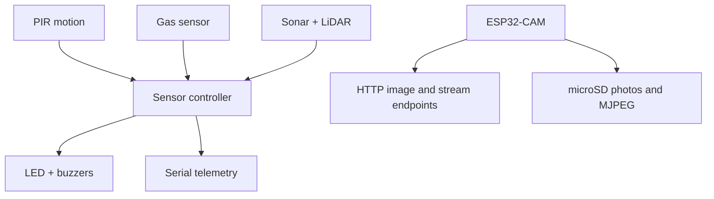

# Architecture

## Current prototype

The project uses two independently programmed controllers. This separation keeps time-sensitive camera work away from the sensor polling and alarm loop.

There is no inter-controller trigger in the supplied firmware. The detector raises local alerts, while the ESP32-CAM exposes network capture controls.

## Sensor-processing path

1. The HC-SR04-style sensor supplies a sonar distance.
2. A five-sample moving average smooths sonar jitter.
3. The TFLI2C-compatible module supplies a LiDAR/ToF distance.
4. The estimator predicts one process step, updates with sonar, then updates with LiDAR.
5. Motion plus corroborating range measurements activates the intrusion alarm.
6. Elevated gas values activate a repeating alarm; a critical value latches the alarm until reset.

The measurement-noise constants weight LiDAR more strongly than sonar:

| Parameter | Value | Meaning |
| --- | ---: | --- |
| Process noise `Q` | `0.1` | Expected variation between cycles |
| Sonar measurement noise | `0.3` | Lower confidence in sonar |
| LiDAR measurement noise | `0.1` | Higher confidence in LiDAR/ToF |

These are prototype tuning values, not statistically calibrated sensor models.

## ESP32-CAM service

The camera sketch:

- initializes the AI Thinker pin mapping;
- joins a configured Wi-Fi network;
- serves still JPEGs at three resolutions;
- streams multipart MJPEG;
- writes still images to microSD; and
- can append streamed frames to an experimental `.mjpeg` file.

The server has no authentication, rate limiting, or TLS. Treat it as a trusted-LAN demonstration.

## Suggested next integration

A future revision can connect the subsystems using either:

- a protected GPIO trigger from the sensor controller to the ESP32-CAM; or
- an authenticated local HTTP request sent when the detector meets its trigger conditions.

Whichever method is used should include debouncing, event identifiers, cooldown timing, and a clear failure mode when the camera is offline.
