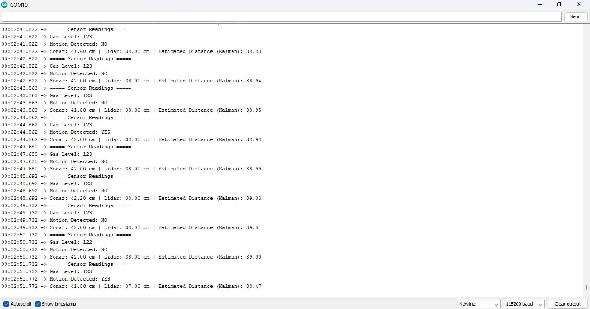

# Testing and calibration

## Captured serial evidence

The captured session demonstrates:

- gas values of approximately `122–123`;
- sonar values of approximately `41.6–42.2 cm`;
- LiDAR/ToF values of approximately `37–38 cm`;
- a fused estimate settling around `38.5–39.0 cm`; and
- PIR transitions between `NO` and `YES`.

The different raw distance values are expected because the sensors have different offsets, fields of view, noise, and mounting positions.

## Bench-test checklist

### Power and startup

- [ ] Confirm the sensor controller and ESP32-CAM receive stable power.
- [ ] Confirm every module shares the intended ground reference.
- [ ] Verify `LiDAR initialized successfully` appears after reset.
- [ ] Verify the ESP32-CAM reports `CAMERA OK` and prints an IP address.

### Distance sensing

- [ ] Place a flat target at known distances across the `30–80 cm` trigger zone.
- [ ] Record sonar, LiDAR, and fused estimates at each point.
- [ ] Test angled, soft, narrow, and reflective targets separately.
- [ ] Confirm an invalid sonar return falls back without destabilizing the estimate.

### Motion and intrusion logic

- [ ] Verify PIR state changes in the Serial Monitor.
- [ ] Confirm motion outside the distance window does not trigger the intrusion alarm.
- [ ] Confirm motion inside the window, corroborated by both range sensors, activates the LED and loud buzzer.
- [ ] Check for repeated alarms and add a cooldown if required by the installation.

### Gas/smoke sensing

- [ ] Allow the sensor to complete its recommended warm-up period.
- [ ] Record a clean-air baseline across several minutes.
- [ ] Test only with a safe, controlled source appropriate for the sensor.
- [ ] Confirm the normal threshold produces the repeating alert.
- [ ] Confirm the critical threshold latches the LED/buzzer state until reset.

### Camera service

- [ ] Open each still-image endpoint and confirm its expected resolution.
- [ ] Open `/stream` and watch for frame or connection failures.
- [ ] Insert a compatible microSD card and test `/save-photo`.
- [ ] Start recording, connect to `/stream`, disconnect the stream, then stop recording.
- [ ] Confirm stored files can be read on another device.

## Known prototype limitations

- The sensor and camera controllers are not automatically linked in the supplied sketches.
- The camera web interface is unauthenticated and intended for a trusted LAN only.
- Streaming blocks other HTTP handling while the client stays connected.
- The `.mjpeg` recorder is experimental and depends on a live stream supplying frames.
- Gas thresholds are raw ADC counts and require installation-specific calibration.
- The estimator parameters are practical tuning values rather than a formal noise-characterization result.
